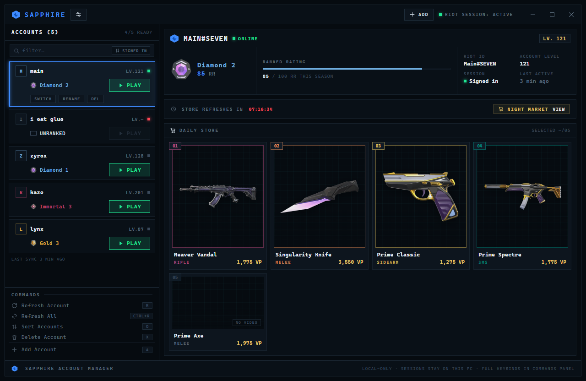
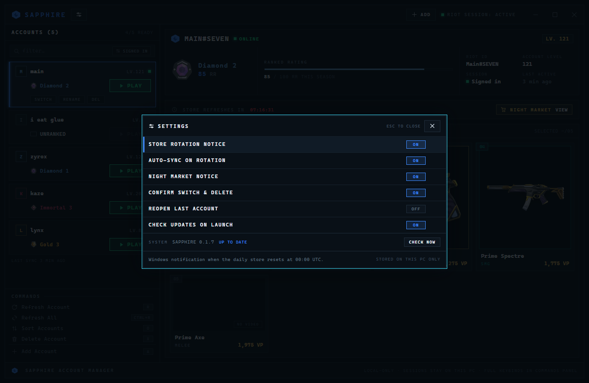
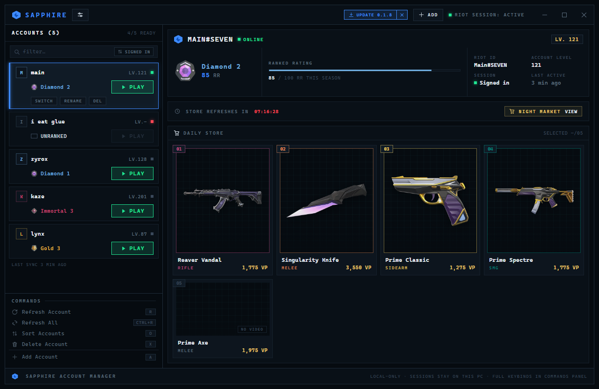
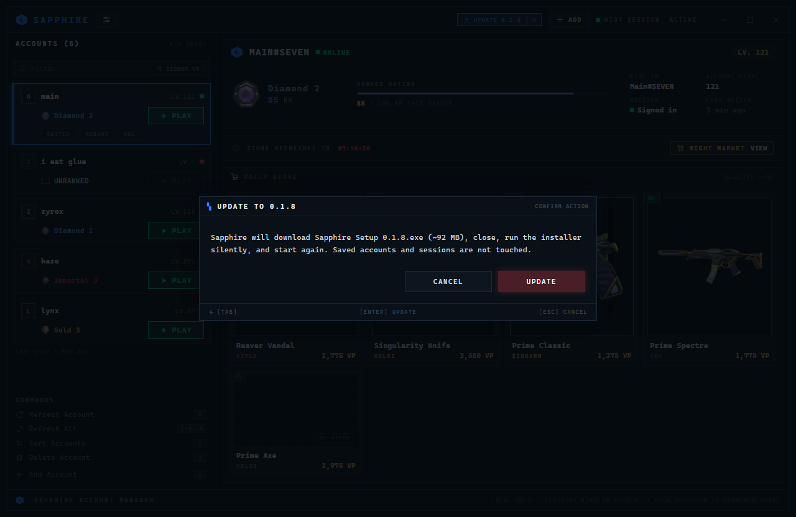

# Sapphire

A Windows desktop app for viewing the daily Valorant store across saved Riot Client accounts: a keyboard-first terminal-style dashboard showing the current store, Riot ID, account level, rank, RR, and the time until the store refreshes.



## Features

- Daily store for every saved account: skin names, rendered art, VP prices, and a countdown to the rotation.
- Every offer is framed in its skin's tier colour, so the tier reads at a glance without a label.
- Night Market, when Riot is running one: that account's six discounted offers, sorted by tier and then by discount, each drawn in its own tier colour and marked once opened.
- Skin previews — upgrade levels and colour variants — in a modal, with a volume slider that persists across skins and restarts.
- Riot ID, account level, competitive rank, RR and placement progress, per account.
- Save and switch Riot Client sessions, or import them from TCNO Account Switcher.

## Installation

Download [`Sapphire Setup <version>.exe`](../../releases) and run it. The portable `Sapphire <version>.exe` runs without installing.

> Windows may show a SmartScreen warning: the installer is not code-signed. After that, updates come from inside the app ([Updates](#updates)), and saved accounts in `%APPDATA%\valorant-account-manager` survive them.

## Usage

1. **Add an account.** Sign in to the account in Riot Client, then select **Add account** (`A`) and give it a label.
   - **Save current account** saves the session that is already active.
   - **Add manually** closes Riot Client and Valorant, opens Riot's sign-in screen, and saves the account once you sign in. The current local session is backed up first.
   - Snapshots detected from TCNO Account Switcher can be imported as well (`I`).
2. **Pick an account** with `↑`/`↓` (or `O` to change the sort order); the daily store for that account fills the panel on the right. Point at an offer by hovering it or with `←`/`→`. Nothing is pointed at until you do — the header reads `SELECTED —/06` — and pointing at one names it there.
3. **Refresh it** with `R`, or every account with `Ctrl+R`.
4. **Open the market view** with `M` — the store on its own, larger. `H` collapses the offer previews.
5. **Preview a skin** with `P`, which plays the in-game video of the offer you are pointing at. The cards are not buttons: the only thing to click inside one is its **PREVIEW** button.
6. **Open the Night Market** when Riot is running one — a `NIGHT MARKET VIEW` entry appears in the `STORE REFRESHES IN` row, and lists that account's discounted offers. `Esc` goes back.
7. **Switch the Riot session to an account** with `S`: the saved session is restored and Riot Client opens.

Riot Client must be running and signed in before the app can read a session. Its install location does not matter: Sapphire reads where this PC put it, so another drive is fine.

## Keyboard shortcuts

The app is keyboard-first; the same list is in the **Commands** panel in the sidebar.

| Key | Action |
| --- | --- |
| `↑` / `↓` | Move between saved accounts |
| `←` / `→` | Point at a daily store offer |
| `Enter` | Open the market view for the selected account |
| `S` | Switch to the selected account |
| `R` | Refresh the selected account |
| `Ctrl+R` | Refresh all accounts |
| `P` | Preview the video of the offer you are pointing at |
| `H` | Show or hide skin previews |
| `O` | Cycle the account sort order |
| `M` | Toggle the market view |
| `A` | Add an account |
| `X` | Delete the selected account |
| `I` | Import detected TCNO accounts (when available) |
| `Esc` | Close the open panel or preview |
| `F11` | Toggle fullscreen |
| `Q` | Quit |

## Settings

Open the panel with the button next to the app name in the header. `↑`/`↓` move, `Enter` or `←`/`→` change the focused row, `Esc` closes.

| Setting | What it does |
| --- | --- |
| STORE ROTATION NOTICE | Windows notification when the daily store resets at 00:00 UTC. |
| AUTO-SYNC ON ROTATION | Pull every saved account automatically at the reset. |
| CONFIRM SWITCH & DELETE | Ask before restarting Riot Client or deleting a saved account. Defaults to on. |
| REOPEN LAST ACCOUNT | Reopen the account you were viewing last, instead of the signed-in one. |
| CHECK UPDATES ON LAUNCH | One small request to GitHub at startup. CHECK NOW works either way. |

A row that differs from its default is marked in blue and carries a `↺` that resets just that row. Preferences are stored locally; nothing is sent anywhere.

The last row, **SYSTEM**, shows the running version and the update state, with **CHECK NOW**.



## Updates

Install once; after that the app updates itself from this repository's GitHub Releases. A newer version puts a pill in the header, and the confirmation it opens:





The `×` hides the notice for the session only and never skips the version, so the SYSTEM row in settings keeps showing it. Saved accounts and sessions are untouched by an update. The download is checked against the SHA-256 published with the release before it runs — that shows the file arrived intact, not who published it, since the installers are unsigned. A release with no digest is refused.

### Publishing a release

One asset: the installer. Attach it to a normal release — drafts and prereleases are ignored by the updater, and the portable build is not needed.

```powershell
npm version patch --no-git-tag-version
npm run package:win
git tag v0.1.4
git push origin main --tags
```

Then create the release for that tag with `release\Sapphire Setup <version>.exe` attached.

## Development

Needs Windows 10+, Node.js LTS, npm, and Riot Client with Valorant installed.

```powershell
npm install
npm run dev      # Vite + Electron; renderer changes reload live
```

For a production-style run instead, `npm run build` then `npm start`. `npm run package:win` writes the installer and portable `.exe` into `release`.

### Checks

```powershell
npm run verify
```

Runs all five gates; each is also available on its own.

| Command | Purpose |
| --- | --- |
| `npm run check` | Syntax-check the Electron main-process files. |
| `npm run bridge` | Diff renderer bridge calls against the preload bridge. |
| `npm run lint` | ESLint, with `lint:summary` to group results by rule. |
| `npm test` | Unit tests, once (`test:watch` to watch). |
| `npm run build` | Production renderer build. |

`css:dead` and `js:dead` list unreferenced class selectors and exports.

`bridge` and `lint` cover the two ways a call can fail silently at runtime while every other gate stays green. `bridge` catches a renderer call to a method the preload never exposed — it throws only in the packaged app, because the dev mock implements a superset of the real preload. `lint` catches identifiers that do not resolve, which otherwise fail inside an event listener and take the whole keyboard shortcut map down with no visible symptom.

## Security and privacy

This app is intended for your own Riot accounts on your own Windows computer.

- Session snapshots are stored with Electron's OS-backed encryption (`safeStorage`). Authentication tokens stay in the main process and are never exposed to the renderer.
- The app never asks for your Riot username or password.
- Switching writes saved Riot Client `Data` and `Config` snapshots back to the local Riot Client directory. Close Valorant before switching, and do not use this with accounts you do not own.

## Limitations

- Depends on Riot Client and Valorant service endpoints that may change without notice. Store, rank and level data are available only while the session stays valid.
- Updates are checksum-verified, but the installers are unsigned, so the download's origin is not authenticated; see [Updates](#updates).
- Unofficial project, not affiliated with or endorsed by Riot Games.
